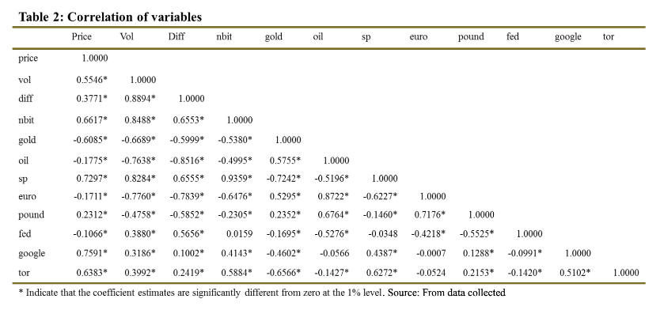
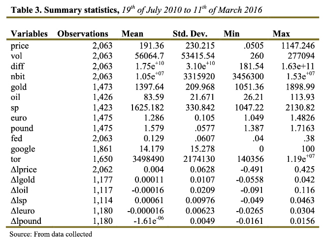
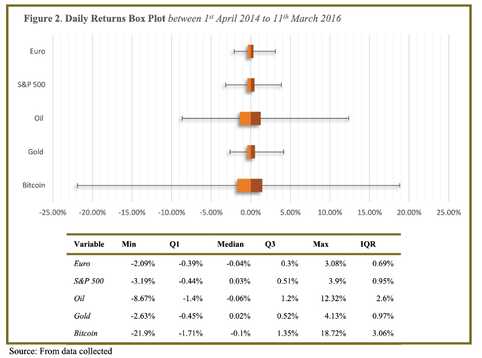
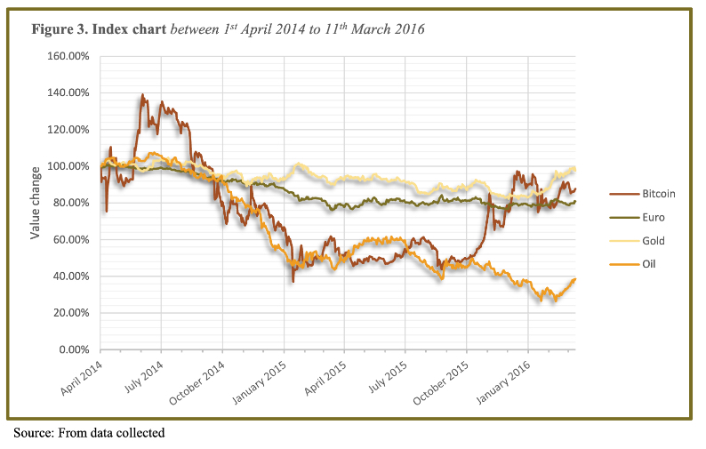
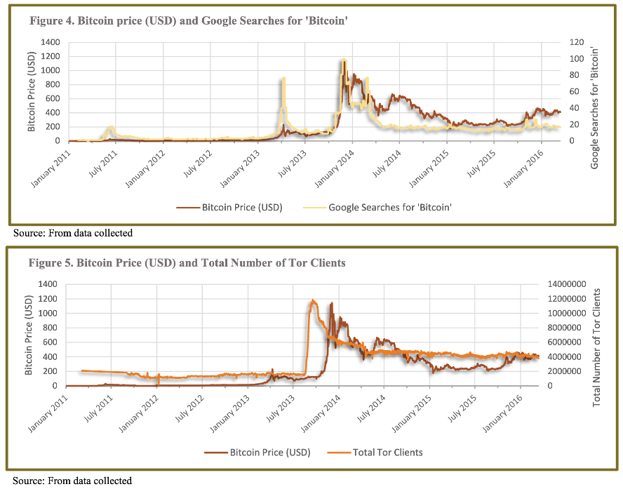
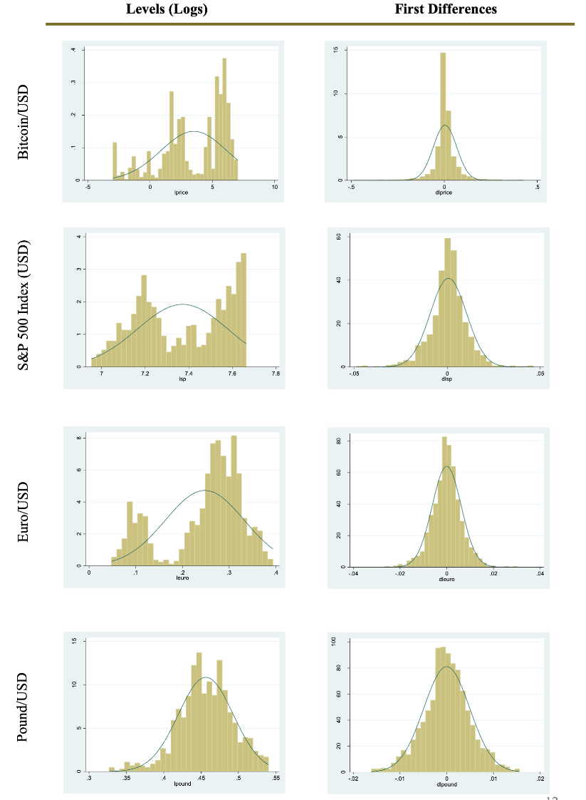
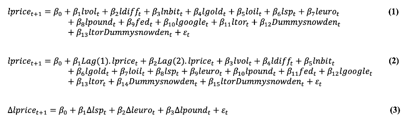
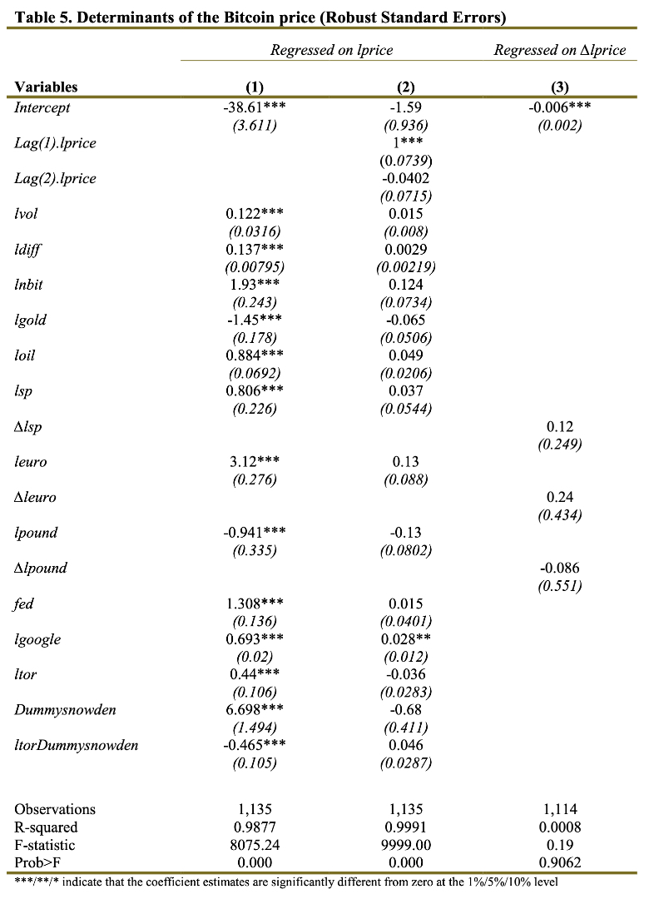

# Bitcoin - Multiple Linear Regression 

**Table of Contents**
- [Introduction](#introduction)
- [Motivation](#motivation)
- [Dependent Variable](#dependentvariable)
- [Independent Variables](#independentvariables)
- [Data Exploration](#dataexploration)
- [Data Preparation](#datapreparation)
- [Predictive Models](#predictivemodels)
- [Results](#results)

## Introduction 
Supervised machine learning to create a model that predicts the Bitcoin price.

Please download the PDF in this repo for more detail. Below only gives a brief overview.

## Motivation 
This was a paper I wrote during my Masters degree which achieved 90% the highest on the course. I was highly motivated in this project due to my interest in statistics, maths, and using machine learning to make predictions.

## Data Sources 
- Coindesk
- Thomson Reuters
- Tor Metrics
- Google Trends
- Federal Reserve

## Dependent Variable 
* Bitcoin/USD Spot Rate

## Independent Variable (Features) 
* Coindesk
  * Daily Bitcoin transactions
  * Difficulty mining Bitcoin
  * Total number of Bitcoins in circulation
* Thomson Reuters
  * Gold spot price
  * Oil spot price
  * Euro/USD spot price
  * GBP/USD spot price
* Federal Reserve
  * Effective federal funds rate
* Google
  * Google searches for Bitcoin
* Tor Metrics
  * Total number of Tor clients 

## Data Exploration 

### Correlation Between Variables

### Summary Statistics

### Standard Deviations and IQR

### Time Series - Variable Percentage Change

### Time Series - Bitcoin against Google Searches and Tor Clients

## Data Preparation 
### Data cleaning
* Took first difference to ensure variables are on the same scale
* Filled in missing values for Google Trends by duplicating weekly values to whole week
* Date range adjusted to ensure all variables are within scope

### Histogram - Showcasing effects of first difference transformation

## Predictive Models 

## Results 

